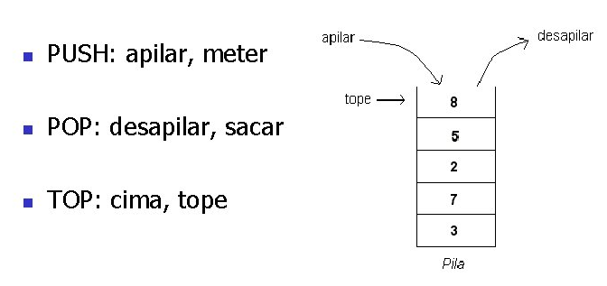
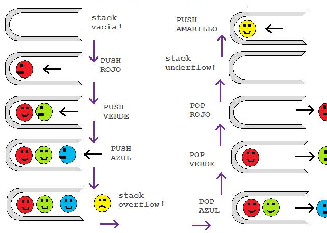

# Ejercicio: Genéricos e Iteradores (Pila + reverse)

## Objetivo
Practicar **genéricos** en Kotlin creando una estructura de datos reutilizable (`Pila....`) y aplicándola para invertir listas mediante una función genérica `reverse`.

## Enunciado (con apoyo visual)





Las operaciones que se realizan con la pila siguen la política **LIFO** (Last In, First Out). Implementa una pila haciendo uso de una **lista** como almacenamiento interno.

## Requisitos
El ejercicio consta de 2 partes:

1. Crear una clase `Pila....`:
   - Debe funcionar con **cualquier tipo** gracias a genéricos.
   - Piensa como debe estar implementada internamente la pila para que las operaciones sean eficientes (pista: la parte superior de la pila debe ser el final de la lista).
   - Operaciones mínimas:
     - `push(elemento)`: apilar (insertar).
     - `pop()`: desapilar (eliminar y devolver el tope).
     - `peek()`: devolver el tope sin eliminarlo.
     - `isEmpty()`: indicar si está vacía.
     - `size`: número de elementos.
   - Debe implementar `Iterable<T>` para poder recorrerse con `for (...)`.
     - Para este ejercicio, el iterador debe recorrer la pila **de tope a base** (el primer elemento iterado es el que devolvería `pop()`).

2. Crear una función genérica `reverse`:
   - Recibe una lista `List<T>` de cualquier tipo.
   - Devuelve una nueva lista con los elementos en orden inverso.
   - **Obligatorio**:
     - Recorrer la lista usando `Iterator`.
     - Usar la clase `Pila...` para invertir el orden.

## Código de prueba (referencia)
El siguiente ejemplo debe imprimir `Correcto` y la lista invertida:

```kotlin
val numbers = listOf("one", "two", "three", "four")
val numbersRev = reverse(numbers)
if (listOf("four", "three", "two", "one") != numbersRev)
    println("Error")
else
    println("Correcto")
println(numbersRev)
```

## Estructura en este proyecto
- Implementación: `src/main/kotlin/org/iesra/revilofe/un4/eje4_4/Pila.kt`
- Ejecución de ejemplo: `src/main/kotlin/Main.kt`
- Tests: `src/test/kotlin/org/iesra/revilofe/un4/eje4_4/PilaTest.kt`

## Ejecutar
- Ejecutar el ejemplo: `./gradlew run`
- Ejecutar tests: `./gradlew test`

## Fuentes del enunciado (referencia)
- Material base: `Generics.md` del repositorio IESRA-DAM-Prog y documento publicado de Google Docs (enlaces proporcionados en la tarea).

